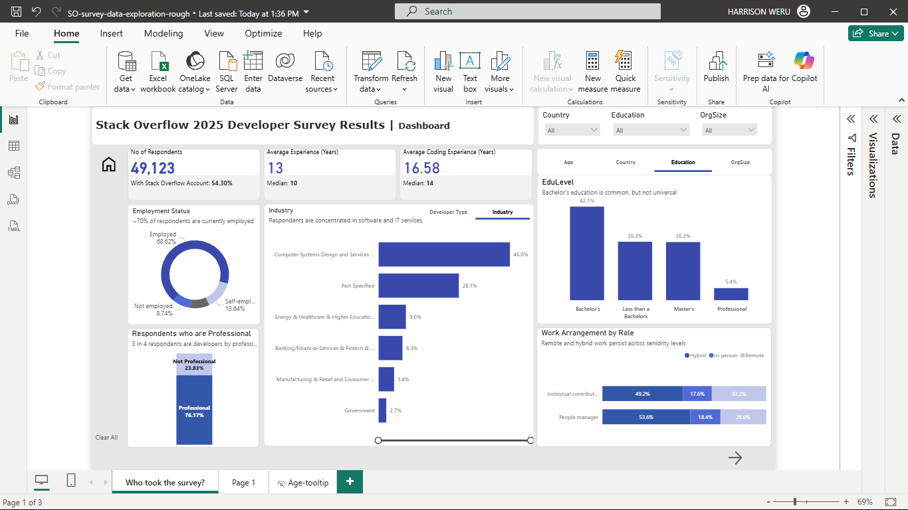

# Stack Overflow 2025 Developer Survey — Executive Dashboard
The [Stack Overflow Developer Survey](https://survey.stackoverflow.co/2025) is one of the richest public datasets about the global developer community. Every year it captures how developers learn, work, and think about tools. This project visualises the 2025 survey with the goal of transforming responses into an executive-friendly dashboard. Instead of asking “What does every chart say?”, I asked:
**“What does leadership actually need to understand from this data?”**

I downloaded the data [here](https://survey.stackoverflow.co/).

---

## What This Report Answers
- Who are developers today?
- How experienced aare they?
- Where and how do they work?
- How global is the Stack Overflow audience?
- Where does Stack Overflow fit in a world shaped by AI tools?

---

## How I Built It
When I first opened the Stack Overflow survey data, the biggest challenge was how encoded and fragmented many of the key fields were. Important variables like age, education, employment, and organization size were stored with long categories, which made them hard to interpret and difficult to read in charts.

So the first thing I focused on was making the data readable.

I created cleaned dimension tables that grouped responses into categories that actually make sense in a conversation. Once the dimensions were cleaned, I merged them into a `star schema` centered on the main survey table. This made the model easier to reason about, improved performance, and gave me a clean foundation for building measures and interactions. I also took time to correct data types and remove unnecessary fields to keep the model focused.

On top of this model, I built `DAX measures`. I used field parameters to allow certain visuals to switch between related perspectives — like developer roles and industries — without duplicating charts. This kept the dashboard compact while still flexible.

### In Power BI, I focused on story-driven design:
- Used dynamic views to switch between developer roles and industries
- Added annotations and subtitles to explain why charts matter
- Designed layouts for non-technical stakeholders

---

## Key Observations
The dashboard shows that the Stack Overflow developer community is experienced and globally distributed. Most respondents are employed professional developers who work hybrid work environments. The population is skewed toward early- to mid-career professionals, particularly those aged 25–44, with an average of over a decade of coding experience. Developers are predominantly hands-on practitioners, led by full-stack and back-end roles, and they primarily work in small-to-mid organisations. While a bachelor’s degree is the most common educational background, a significant share of respondents entered the field through non-traditional or alternative learning paths. Geographically, responses span all major regions, with strong representation from North America, Europe, and South Asia.

---

## Final Notes
I used this project to learn how to emphasise clarity, structure, and narrative over surface-level statistics. It demonstrated how data analysis can support decision-making for executives.

**If you have feedback or suggestions, feel free to open an issue or reach out: `weruharim@gmail.com`.**

